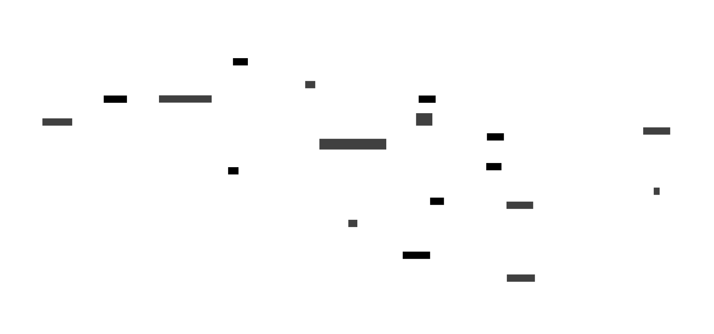

# MCP-Diagram

Un serveur MCP (Model-Client-Protocol) pour générer facilement des diagrammes à partir de descriptions textuelles dans Claude et d'autres assistants IA.

## 🌟 Fonctionnalités

MCP-Diagram permet de créer facilement différents types de diagrammes directement depuis votre conversation avec Claude :

- Diagrammes d'architecture (D2Lang et Mermaid)
- Diagrammes de classes UML (Mermaid)
- Diagrammes Entité-Relation (Mermaid)
- Diagrammes de séquence (Mermaid)
- Diagrammes Gantt (Mermaid)
- Cartes mentales (Mermaid)
- Frises chronologiques (Mermaid)

## 📋 Prérequis

- Java Runtime Environment (JRE) 17 ou supérieur
- Claude Desktop installé (pour l'intégration avec Claude)

## 🚀 Installation

### Étape 1 : Télécharger le serveur MCP

Téléchargez le fichier JAR depuis la [dernière version](https://github.com/tenpigs267/mcp-diagram/releases/latest).

### Étape 2 : Configuration de Claude Desktop

Ajoutez le serveur à votre fichier `claude_desktop_config.json` :

```json
{
    "mcpServers": {
        "mcp-diagram": {
            "command": "java",
            "args": [
                "-jar",
                "CHEMIN/VERS/mcp-diagram-X.Y.Z.jar"
            ]
        }
    }
}
```

> ⚠️ **Important** : Remplacez `CHEMIN/VERS/mcp-diagram-X.Y.Z.jar` par le chemin complet où vous avez téléchargé le fichier JAR. ("C:\\CHEMIN\\VERS\\mcp-diagram-1.0.0.jar" sous Windows)

## 🔧 Utilisation

Une fois configuré, vous pouvez simplement demander à Claude de créer des diagrammes en décrivant ce que vous souhaitez. Le serveur MCP s'occupera du reste !

### Fonctions disponibles

#### 1. `getD2LangComplexDiagram`
Génère un diagramme complexe en utilisant la grammaire déclarative D2Lang, parfait pour des architectures logicielles ou réseaux.

#### 2. `getMermaidClassDiagram`
Génère un diagramme de classes UML en utilisant la syntaxe Mermaid.

#### 3. `getMermaidComplexDiagram`
Génère un diagramme complexe en utilisant la syntaxe Mermaid (architecture logicielle, réseau, etc.).

#### 4. `getMermaidErDiagram`
Génère un diagramme Entité-Relation en utilisant la syntaxe Mermaid.

#### 5. `getMermaidGanttDiagram`
Génère un diagramme de Gantt en utilisant la syntaxe Mermaid.

#### 6. `getMermaidMindMapDiagram`
Génère une carte mentale en utilisant la syntaxe Mermaid.

#### 7. `getMermaidSequenceDiagram`
Génère un diagramme de séquence en utilisant la syntaxe Mermaid.

#### 8. `getMermaidTimelineDiagram`
Génère une frise chronologique en utilisant la syntaxe Mermaid.

## 📝 Exemple d'utilisation

Voici un exemple de prompt pour générer un diagramme d'architecture AWS :

```
Crée un diagramme d2lang d'une architecture AWS avec un CloudWatch qui utilise une lambda en tant qu'orchestrator. 
La lambda utilise un SNS, un DynamoDB et un EC2 dans un autoscaling group. 
L'EC2 se connecte aussi au même dynamoDB. 
L'EC2 dans un autoscaling group utilise une Amazon EFS en source et un autre en backup. 
L'EC2 et les EFS sont dans un VPC. 
L'EC2 utilise aussi un Amazon S3.
```

Le résultat sera un lien vers le diagramme généré que vous pourrez visualiser dans votre navigateur.



## 🔍 Dépannage

### Le serveur MCP ne démarre pas
- Vérifiez que Java version 17 ou plus est correctement installé (`java -version`)
- Assurez-vous que le chemin vers le fichier JAR est correct dans votre configuration
- Assurez-vous que le fichier JAR téléchargé ait bien l'autorisation de s'exécuter (dans les "propriétés" du fichier JAR)

### Les diagrammes ne s'affichent pas
- Vérifiez que votre navigateur peut accéder à Internet
- Assurez-vous que les URLs générées ne sont pas bloquées par un pare-feu

## 📄 Licence

Ce projet est sous licence MIT - voir le fichier [LICENSE](LICENSE) pour plus de détails.
